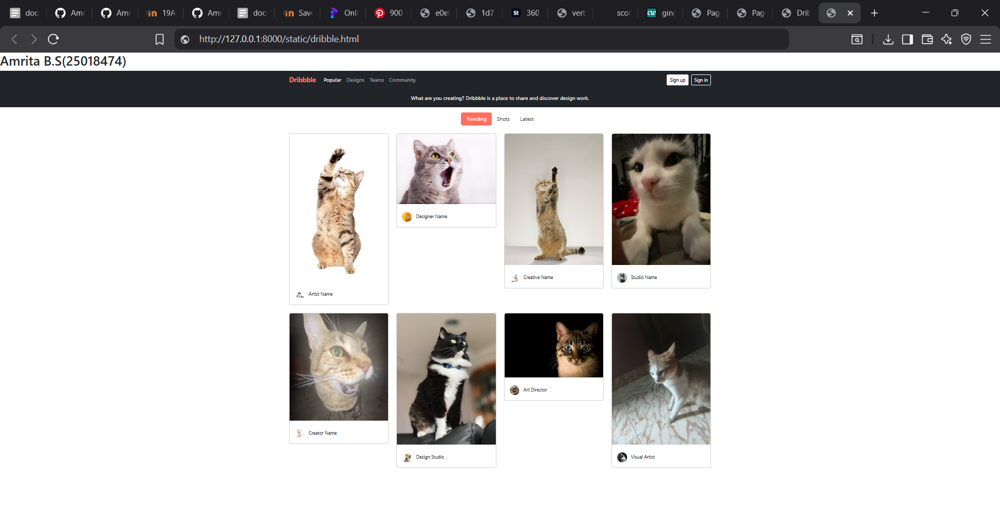

# Project Responsive Web Design using Bootstrap
## Date:

## AIM:
To create a simplified clone of Dribbble (https://dribbble.com/) landing page.


## DESIGN STEPS:

### Step 1:
Clone the repository from GitHub.

### Step 2:
Create Django Admin project.

### Step 3:
Create a New App under the Django Admin project.

### Step 4:
Insert the necessary CSS and JavaScript files as external in order to use Bootstrap.

### Step 5:
Create a HTML file and include the needed Bootstrap components.

### Step 6:
Publish the website in the LocalHost.

## PROGRAM :
```
<html lang="en">
<head>
  <meta charset="UTF-8">
  <meta name="viewport" content="width=device-width, initial-scale=1">
  <title>Dribbble Clone</title>
  <link href="https://cdn.jsdelivr.net/npm/bootstrap@5.3.0/dist/css/bootstrap.min.css" rel="stylesheet">
  <link rel="stylesheet" href="style.css">
</head>
<body>
    <h1 align="text-center">Amrita B.S(25018474)</h1>
  <nav class="navbar navbar-expand-lg bg-dark navbar-dark">
    <div class="container">
      <a class="navbar-brand" href="#">Dribbble</a>
      <button class="navbar-toggler" data-bs-toggle="collapse" data-bs-target="#nav">
        <span class="navbar-toggler-icon"></span>
      </button>
      <div class="collapse navbar-collapse" id="nav">
        <ul class="navbar-nav me-auto">
          <li class="nav-item"><a class="nav-link active" href="#">Popular</a></li>
          <li class="nav-item"><a class="nav-link" href="#">Designs</a></li>
          <li class="nav-item"><a class="nav-link" href="#">Teams</a></li>
          <li class="nav-item"><a class="nav-link" href="#">Community</a></li>
        </ul>
        <a class="btn btn-light btn-sm me-2" href="#">Sign up</a>
        <a class="btn btn-outline-light btn-sm" href="#">Sign in</a>
      </div>
    </div>
  </nav>

  <div class="bg-dark text-white text-center py-3">
    <p class="mb-0">What are you creating? Dribbble is a place to share and discover design work.</p>
  </div>

  <div class="container mt-3">
    <ul class="nav nav-pills justify-content-center">
      <li class="nav-item"><a class="nav-link active" href="#">Trending</a></li>
      <li class="nav-item"><a class="nav-link" href="#">Shots</a></li>
      <li class="nav-item"><a class="nav-link" href="#">Latest</a></li>
    </ul>
  </div>

  <div class="container mt-4">
    <div class="row">
      <!-- Card 1 -->
      <div class="col-md-3">
        <div class="card mb-4">
          
          <div class="card-body">
            <div class="mt-2">
              
              <small>Artist Name</small>
            </div>
          </div>
        </div>
      </div>
      <!-- Card 2 -->
      <div class="col-md-3">
        <div class="card mb-4">
          
          <div class="card-body">
            <div class="mt-2">
              
              <small>Designer Name</small>
            </div>
          </div>
        </div>
      </div>
      <!-- Card 3 -->
      <div class="col-md-3">
        <div class="card mb-4">
          
          <div class="card-body">
            <div class="mt-2">
              
              <small>Creative Name</small>
            </div>
          </div>
        </div>
      </div>
      <!-- Card 4 -->
      <div class="col-md-3">
        <div class="card mb-4">
          
          <div class="card-body">
            <div class="mt-2">
              
              <small>Studio Name</small>
            </div>
          </div>
        </div>
      </div>
      <!-- Card 5 -->
      <div class="col-md-3">
        <div class="card mb-4">
          
          <div class="card-body">
            <div class="mt-2">
              
              <small>Creator Name</small>
            </div>
          </div>
        </div>
      </div>
      <!-- Card 6 -->
      <div class="col-md-3">
        <div class="card mb-4">
          
          <div class="card-body">
            <div class="mt-2">
              
              <small>Design Studio</small>
            </div>
          </div>
        </div>
      </div>
      <!-- Card 7 -->
      <div class="col-md-3">
        <div class="card mb-4">
          
          <div class="card-body">
            <div class="mt-2">
              
              <small>Art Director</small>
            </div>
          </div>
        </div>
      </div>
      <!-- Card 8 -->
      <div class="col-md-3">
        <div class="card mb-4">
          
          <div class="card-body">
            <div class="mt-2">
              
              <small>Visual Artist</small>
            </div>
          </div>
        </div>
      </div>
    </div>
  </div>

  <script src="https://cdn.jsdelivr.net/npm/bootstrap@5.3.0/dist/js/bootstrap.bundle.min.js"></script>
</body>
</html>

style.css
.card:hover { 
  transform: translateY(-5px); 
  box-shadow: 0 10px 20px rgba(0, 0, 0, 0.15); 
}
.navbar-brand { 
  font-weight: bold; 
  color: #ff6f61 !important; 
}
.nav-pills .nav-link.active {
  background-color: #ff6f61;
}
.nav-pills .nav-link {
  color: #333;
}
```
## OUTPUT:


## RESULT:
The Project for responsive web design using Bootstrap is completed successfully.
